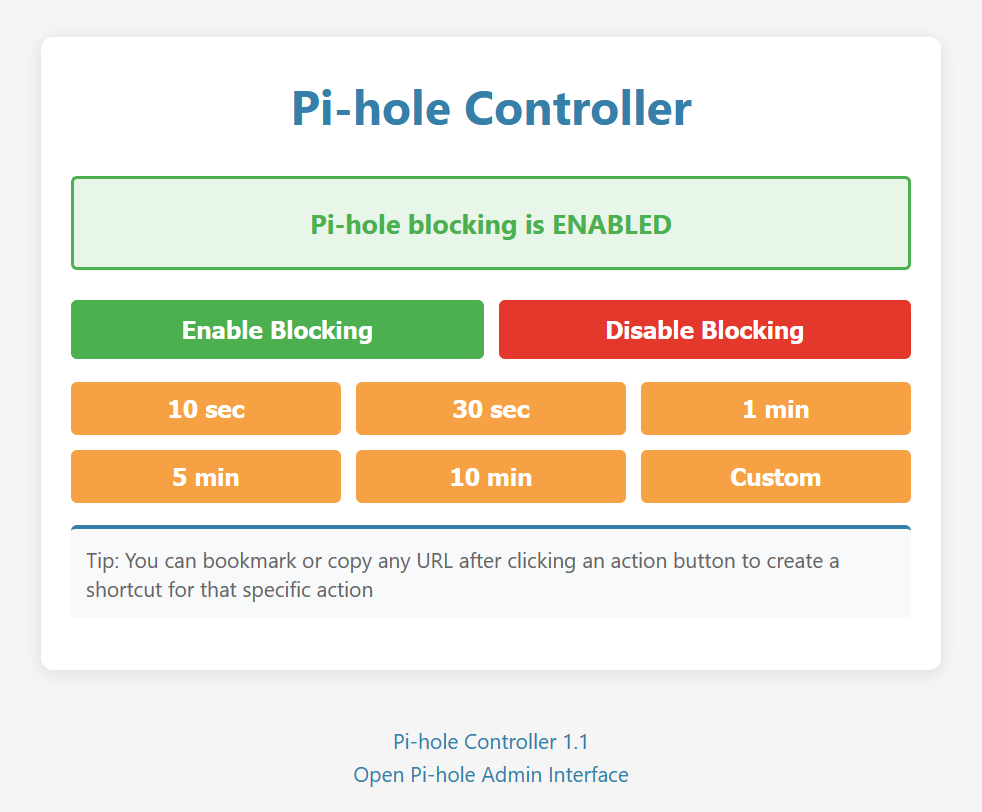

# Pi-hole Controller

A lightweight, single-HTML-file controller for Pi-hole 6 that lets you easily enable or disable blocking. This controller works by communicating with the Pi-hole API using an app password and supports temporary disabling with a countdown timer.



## Overview

The Pi-hole Controller provides a simple web interface for:

- **Enabling/Disabling Blocking:** Instantly toggle blocking on your Pi-hole installation.
- **Temporary Disabling:** Disable blocking for a set duration. The controller will show a countdown timer until the blocking state is automatically restored.
- **Bookmarkable Shortcuts:** Once an action is triggered, you can bookmark or copy the URL to quickly repeat the action later.

## Common Usage Concepts

- **Pi-hole App Password:** To interact with the Pi-hole API, you must generate an app password:

  - Open your Pi-hole Admin Interface.
  - Navigate to **Settings → Web interface / API**.
  - Switch from **Basic** to **Expert** mode.
  - Click **Configure app password** and copy the generated password.

- **Controller URL:** The controller builds URLs that include your Pi-hole URL, app password, and the desired action (enable/disable).

  > **Security Note:** Including your app password directly in the URL can expose it if the URL is logged or shared. Make sure to safeguard this information and only share the URL with trusted parties.

- **Timer Functionality:** When disabling blocking temporarily, you can select a preset duration or set a custom time. A visible countdown timer shows how long until blocking is re-enabled.

## Downloading the Controller

You can download the single HTML file directly from GitHub without needing Git installed. Curl is installed by default on Windows 10/11, macOS, and most Linux distributions.

### Using curl (all platforms)

```bash
curl -o controller.html https://raw.githubusercontent.com/mikeswanson/PiHoleController/main/controller.html
```

## Installing on Your Pi-hole

Follow these steps to install or update the controller on your Pi-hole:

1. Transfer the `controller.html` file to your Pi-hole:

   ```bash
   scp controller.html pi@pi.hole:~
   ```

   _(Enter the Pi-hole password when prompted)_

2. SSH into your Pi-hole:

   ```bash
   ssh pi@pi.hole
   ```

   _(Enter the Pi-hole password when prompted)_

3. Move the file to the web server directory:

   ```bash
   sudo mv ~/controller.html /var/www/html
   ```

   _If you try to access the controller by its URL and see a permission denied message, run this command to enable additional read permissions: `sudo chmod 644 /var/www/html/controller.html`_

4. Exit the SSH session:

   ```bash
   exit
   ```

Now, you can access the controller by navigating to `https://pi.hole/controller.html` (or the appropriate hostname/IP) in your web browser.

## Usage

1. **Access the Controller:**
   Open your browser and navigate to your Pi-hole controller URL (e.g., `https://pi.hole/controller.html`).

2. **Log In:**
   Enter your Pi-hole URL and the generated app password to log in. After logging in, you can bookmark the URL to avoid entering the password each time.

3. **Toggle Blocking:**

   - Click **Enable Blocking** to activate blocking.
   - Click **Disable Blocking** to turn it off. If you choose to disable temporarily, select a preset duration or enter a custom duration.

4. **Create Shortcuts:**
   After clicking an action, copy the URL from your browser to bookmark it as a shortcut for that specific action.

## Customization

For family-friendly setups or specialized use cases, you can customize the controller interface using URL parameters:

### Parameters

- **title=Custom+Title**: Sets a custom title for the page (default is "Pi-hole Controller")
- **showButtons=false**: Hides the main Enable/Disable blocking buttons
- **showTips=false**: Hides tips throughout the interface (like password generation instructions and bookmark hints)
- **showFooter=false**: Hides the footer with version info and admin links
- **presets=item1,item2,...**: Define custom preset durations

### Custom Presets Format

Custom presets use the format `Label:Value` separated by commas:

- `Label` is the text shown on the button (use '+' for spaces)
- `Value` is the duration in seconds, or append `m` for minutes, or use `custom`

Examples:

- `presets=Quick:30,5+Minutes:300,Hour:3600`
- `presets=Quick:30,Lunch:45m,Custom:custom`

### Example URL

Simple URL with minimal interface for family use (fill-in `your-password`):

```bash
https://pi.hole/controller.html?url=https://pi.hole&pwd=your-password&title=Internet+Controls&showButtons=false&showTips=false&showFooter=false&presets=10+seconds:10,30+seconds:30,1+minute:1m
```


